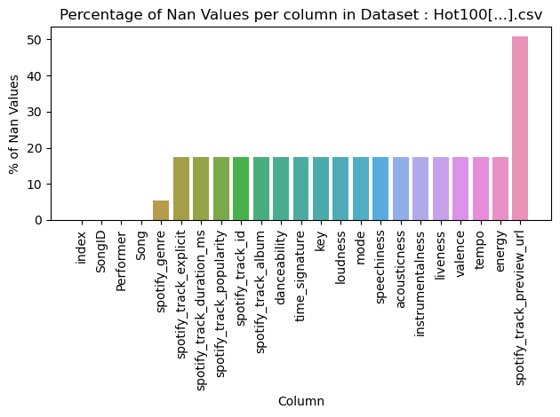
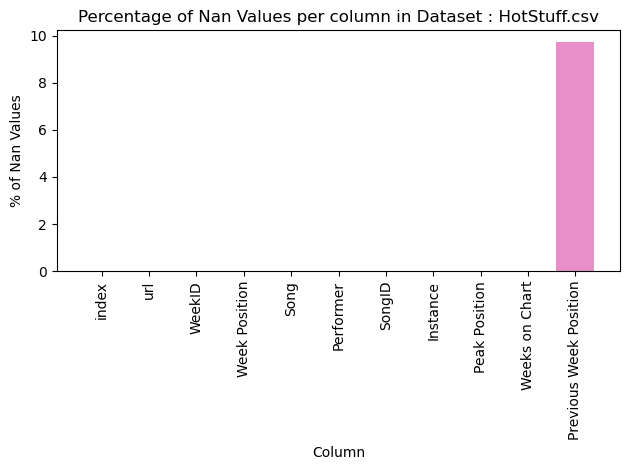
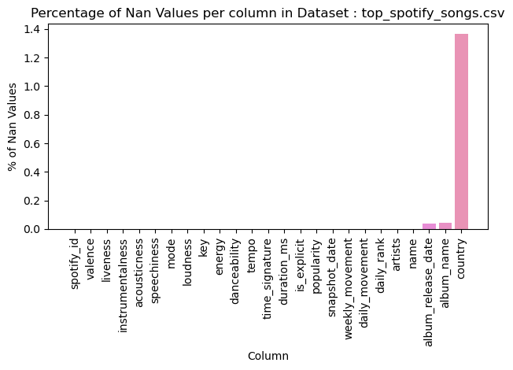
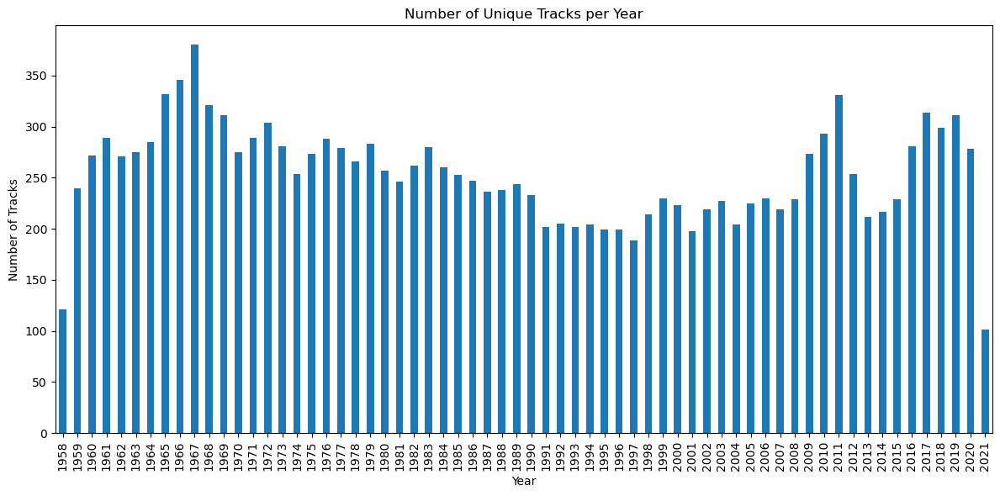
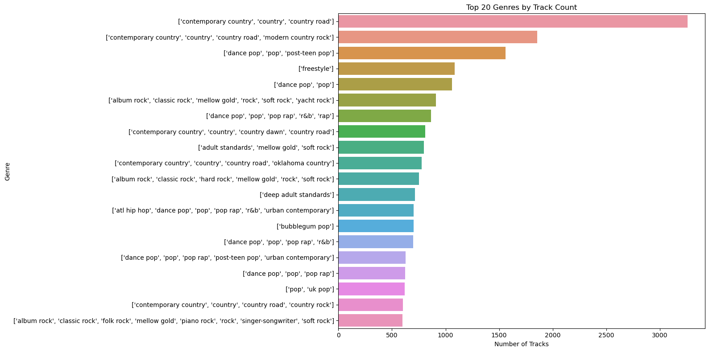
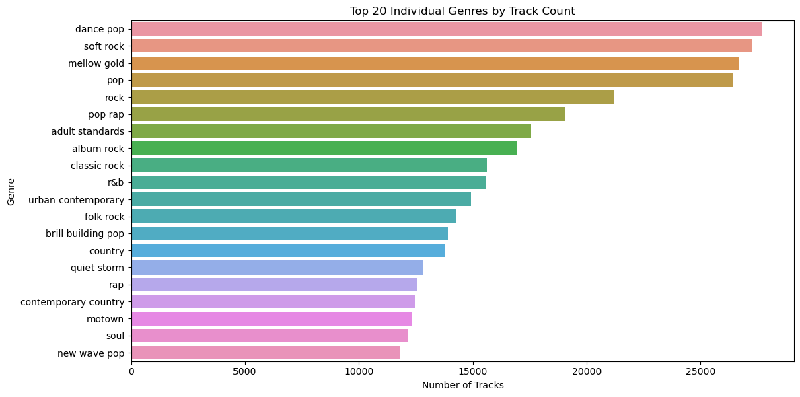
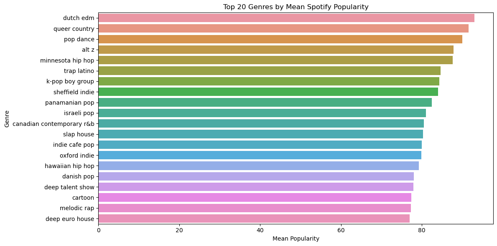
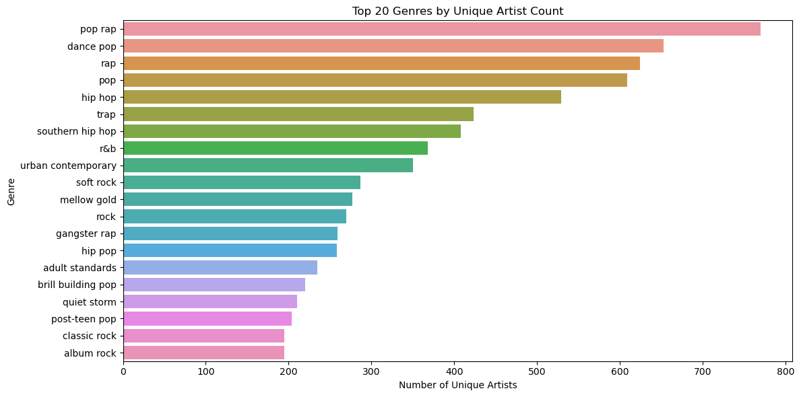
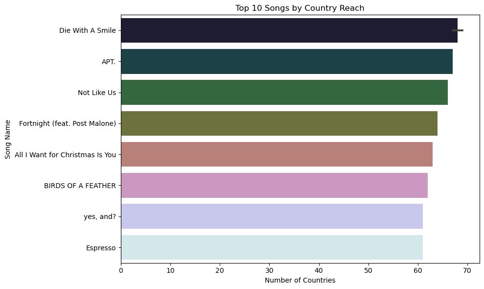
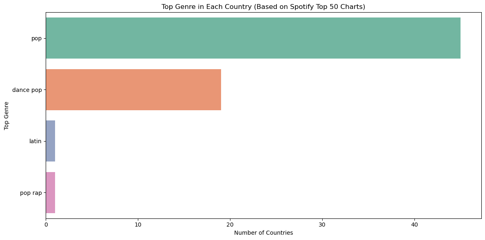

# Project of Data Visualization (COM-480)

| Student's name | SCIPER |
| -------------- | ------ |
|Eltawil Sama Wael Abdelhai Abdelhadi |378051|
|Schifferli Théo Edouard |326468|
|Sipofo Kamegne Yann Eddy |327035|

# Spotify Billboard Hot 100 Analysis 📊🎶

## Milestone 1 (21st March, 5pm)

**10% of the final grade**

This is a preliminary milestone to let you set up goals for your final project and assess the feasibility of your ideas.
Please, fill the following sections about your project.

*(max. 2000 characters per section)*

### Dataset
Our chosen datasets, **[Billboard Hot 100 Weekly Charts with Spotify Audio Features](https://www.kaggle.com/datasets/thedevastator/billboard-hot-100-audio-features)** and **[Top Spotify Songs in 73 Countries Daily Updated](https://www.kaggle.com/datasets/asaniczka/top-spotify-songs-in-73-countries-daily-updated)**, encompass weekly Billboard Hot 100 charts enriched with Spotify's audio features and daily rankings of the most popular songs across 73 countries, providing valuable insights into global music trends, song popularity, and the relationship between audio features and chart performance. 
The datasets are quite clean and requires minimal preprocessing. The only necessary step is handling NaN values, particularly for missing Spotify track previews. Once those are addressed, the dataset should be ready for visualization with little additional effort.

### Dataset 1: Billboard Hot 100 Audio Features

This dataset consists of two files: `Hot Stuff.csv` and `Hot 100 Audio Features.csv`.

#### File 1: `Hot Stuff.csv`

This file contains Billboard Hot 100 chart data for various songs.

**Columns of Interest (11 Total)**:
- `url`: URL of the Billboard chart for the given week.
- `WeekID`: The date of the Billboard chart (week level).
- `Week Position`: The position of the song on the chart for that week. (Numeric)
- `Song`: The title of the song. (Text)
- `Performer`: The name of the performing artist(s). (Text)
- `SongID`: A unique identifier for the song.
- `Instance`: Indicates breaks in the chart for a particular song. (Numeric)
- `Previous Week Position`: The song’s position on the chart in the previous week. (Numeric)
- `Peak Position`: The highest position the song has achieved on the chart. (Numeric)
- `Weeks on Chart`: The total number of weeks the song has been on the chart.

#### File 2: `Hot 100 Audio Features.csv`

This file contains audio features from Spotify for songs that appeared on the Billboard Hot 100.

**Columns of Interest (23 Total)**:
- `SongID`: A unique identifier for the song.
- `Performer`: The name of the performer or artist of the song. (Text)
- `Song`: The title of the song. (Text)
- `spotify_genre` : The genre(s) of the song according to Spotify's classification system. (Text)
- `spotify_track_id` : Spotify Track Id
- `spotify_track_preview_url` : The URL linking to a preview version of the song on Spotify, if available. (Text)
- `spotify_track_duration_ms`: The duration of the track in milliseconds.
- `spotify_track_explicit`: Boolean indicating whether the track contains explicit lyrics.
- `spotify_track_album`: The album in which the track appears. 
- `danceability`: A measure of how suitable a track is for dancing, based on tempo, rhythm stability, beat strength, and overall regularity.
- `energy`: A measure of intensity and activity; high-energy tracks feel fast, loud, and noisy.
- `key`: The key the track is in, using standard Pitch Class notation.
- `loudness`: The overall loudness of a track in decibels (dB).
- `mode`: Indicates the modality (major or minor) of a track.
- `speechiness`: Measures the presence of spoken words in a track.
- `acousticness`: A confidence measure of whether the track is acoustic.
- `instrumentalness`: Predicts whether a track contains no vocals.
- `liveness`: Detects the presence of an audience in the recording.
- `valence`: A measure describing the musical positiveness conveyed by a track.
- `tempo`: The overall estimated tempo of a track in beats per minute (BPM).
- `time_signature`: An estimated overall time signature of a track.
- `spotify_track_popularity`: Popularity score of the track on Spotify.

### Dataset 2: Top Spotify Songs in 73 Countries

This dataset provides daily rankings for the top songs across 73 countries and consists of one file `universal_top_spotify_songs.csv`

**Columns of interest (25 Total)**:
- `spotify_id`: The unique identifier for the song in the Spotify database. (type: str)
- `name`: The title of the song. (type: str)
- `artists`: The name(s) of the artist(s) associated with the song. Do split(', ') to convert to a list (type: str)
- `daily_rank`: The daily rank of the song in the top 50 list. (type: int)
- `country` : The ISO code of the country of the Top 50 Playlist. If Null, then the playlist if 'Global Top 50'. (type: str)
- `snapshot_date`: The date on which the data was collected from the Spotify API. (type: str)
- `popularity`: A measure of the song's current popularity on Spotify. (type: int)

### Problematic 
#### Motivation
**Should you really be writing only *pop* music to make it to the Billboard Hot 100?**

Music is more than just sound, it's a universal language that influences culture, evokes emotions, and shapes generations. From high-energy dance tracks that fuel parties to soulful ballads that stir deep emotions, music plays a powerful role in our daily lives. But what truly determines a song’s success?  

This project seeks to **uncover the hidden patterns behind chart-topping hits** by analyzing the impact of genre, and key musical features, such as energy, tempo, and danceability, on a song’s popularity. Instead of the conventional approach of tracking individual artists over time, we will introduce a **genre race**, visualizing how different musical styles have risen and fallen in popularity over the decades trying to uncover hidden gems in less known genres. This approach will allow us to **map the evolution of listener preferences**, identifying whether certain genres dominate during specific periods and whether emerging trends can help predict the next big hit.

Additionally, a **geographic visualization** will illustrate the **current daily distribution of top genres across different regions**, providing insights into how music tastes vary worldwide and how certain genres gain global traction.

Finally, on a fun and interactive note, we will develop a machine learning model trained to identify which specific feature values (danceability, acousticness, etc.) correspond to particular genres. This will enable real-time inference of the genre that best matches a user’s taste based on their selected musical features inputted through the website. Listeners can then discover tracks that align closely with their preferences via the predicted genre. A similarity measure will be calculated between the user’s input and the ground truth values of tracks to identify the closest match, accompanied by a similarity percentage (e.g., 93% similarity).

#### Research Questions
- **Genre Influence on Chart Performance:** How do different genres correlate with chart positions? Do certain genres have a higher likelihood of reaching top spots?
- **Temporal Genre Trends:** How has the popularity of different genres evolved over the years? Are there dominant genres that define specific eras, or do new styles emerge and reshape the musical landscape?
- **Audio Features & Success Metrics:** What is the relationship between specific audio features (e.g., danceability, energy) and chart success? Are there recognizable patterns that contribute to higher rankings?
- **Spotting Emerging Artists:** How do new artists enter the charts, and what characteristics define tracks that propel them to prominence?

#### Target Audience
- **Music Industry Professionals:** Record labels, producers, and talent scouts seeking data-driven insights.
- **Music Enthusiasts:** Fans interested in the dynamics of music trends and chart movements.
- **Artists & Musicians:** Individuals aiming to understand the elements that contribute to chart success.

### Exploratory Data Analysis
The complete notebook used for our exploratory data analysis can be found [here](./milestone1.ipynb)  
As mentionned above,  the datasets are relatively clean, requiring minimal preprocessing. However, some columns contain NaN values, particularly in fields like Spotify track previews and previous week positions. The visualizations below illustrate the proportion of missing values across different features, helping us determine whether imputation or removal is necessary before moving forward with data exploration and visualization.

From the first plot, we observe that a significant portion of the **Spotify track preview URLs** are missing. Since having a valid preview URL is essential for enabling track playback on our website, we will need to **remove all rows where this field is missing**. This ensures that every track included in our dataset is playable, maintaining a seamless user experience for discovering music through audio previews. (*If this filtering proves too strict, we will revisit and adjust our approach later in the project.*)

For the **previous week position** column, missing values are expected for tracks that have just debuted on the **Billboard** chart. Since these entries represent new songs entering the rankings for the first time, there's no prior position available. Therefore, we will **keep these rows as they are**, as their absence does not indicate missing or faulty data but rather a natural aspect of the charting process.

For the **country** column in the **Top Spotify Tracks per Country** dataset, missing values are problematic since this column is central to our analysis. Since our focus is on track popularity across different countries, we will **remove all rows where the country value is missing** to ensure the dataset remains relevant and accurately represents regional trends in music consumption.

To better understand the temporal distribution of tracks in our dataset, we examined the **number of unique tracks per year**. The bar chart above illustrates how the volume of charting tracks has fluctuated over time, with noticeable peaks and dips. Some years see a higher influx of unique tracks, while others are characterized by greater chart longevity for individual songs. This helps us contextualize how the **Billboard Hot 100** has evolved in terms of turnover and diversity over the decades.

After having merged the `hot stuff` dataset with the `hot 100 Audio Features` we'd like to see the all time top 20 genres in billboard100

In the original dataset, some tracks have an empty genre field ([]). These missing genre labels prevent us from accurately analyzing genre distribution and trends. Since genre information is crucial for our analysis, we removed all rows with empty genres to ensure that only tracks with valid classifications are included in the visualization. This allows us to gain a clearer understanding of the most popular genres without distortions caused by missing data.

Uh oh, the genres are stored as strings that represent lists, meaning each track can belong to multiple genres at once. However, since they are stored as strings, they are not directly usable for proper analysis.

To better analyze genre distributions, we need to split these genre strings into individual genres and count them separately. This allows us to assess the true popularity of each genre across all tracks rather than treating multi-genre tracks as a single category.

The updated genre distribution provides **a much clearer and more insightful** view of the data. By breaking down multi-genre entries into individual genres, we now have a **more accurate representation** of how often each genre appears in the Billboard charts. This refinement highlights the overwhelming presence of **pop-related genres**, reinforcing its dominance in mainstream music. Instead of treating multi-genre tracks as single unique categories, this approach allows us to see which genres truly shape the charts, offering **better insights into music trends**. This enhanced visualization ensures a more precise analysis of genre popularity while preventing any genre from being underrepresented due to formatting inconsistencies.

When comparing the **top 20 genres by mean Spotify popularity** to the **most frequent genres in the Billboard charts**, we see notable differences. While **pop and mainstream genres dominate the Billboard rankings**, the most **popular** genres on Spotify include **niche and regional styles** like **Dutch EDM, queer country, and Minnesota hip hop**. This suggests that while certain genres chart more frequently, others maintain **high engagement and popularity among listeners** despite having fewer total tracks.

As a final perspective, we examine genres based on the **number of unique artists** contributing to them. This visualization highlights the genres with the **widest artist diversity**, showing that **pop rap, dance pop, and rap** attract the largest variety of performers, reinforcing their dominant presence in the industry.

#### Top Spotify Songs Across Countries Dataset
Shifting to this dataset, which tracks Spotify's top songs across multiple countries, this plot highlights the **top 10 songs with the widest global reach**. It shows which tracks are charting in the most countries, offering insight into the most internationally popular songs.

Building on this, we now examine the **most dominant genre in each country** based on **Spotify’s Top 50 charts**. This visualization highlights how **pop and dance pop overwhelmingly lead** across multiple countries, while Latin and pop rap appear in a few regions, reflecting regional preferences in global music consumption.

### Related work

Several websites and research projects have analyzed trends in the **Billboard Hot 100** and song popularity. While **Billboard.com** provides weekly rankings, it lacks interactive exploration of historical data.

Our main inspiration comes from **The Pudding**, particularly:
- **[“A History of Music Genres”](https://pudding.cool/2017/03/music-history/)**, which visualizes how genres have evolved over time.
- **[“Love Songs Through the Decades”](https://pudding.cool/2024/11/love-songs/)**, analyzing lyrical trends in hit songs.

Other platforms like **Kaggle** and **FiveThirtyEight** have explored factors such as artist trends and the impact of streaming on rankings. However, these analyses are often static, lack interactivity, and do not incorporate **audio elements** or **geographic insights**.

##### Our Project
Our project expands on these ideas by offering a **more immersive experience**, allowing users to visualize:

- **Genre dominance** over decades, tracking the evolution of different styles.
- **And understand genre Distribution Over Time:** Race chronological charts illustrating the rise and decline of genre popularity over the years (Top 10).
- **Audio Feature Correlations:** Heatmaps revealing correlations between audio features and average chart rankings.
- **Artist and Genre Debut Analysis:** Line graphs tracking the debut and rise of new artists on the charts.
- **Top Features of Hit Songs:** Radar charts highlighting the distinctive audio feature profiles of top hits.
- **Genrify: Genre and Top Track Predictions:** A prediction of the genre and top track based on danceability, acousticness and other features, followed by an analysis of where they would be most listened to today.

## Milestone 2 (18th April, 5pm)

**10% of the final grade**

## Milestone 3 (30th May, 5pm)

**80% of the final grade**

## Late policy

- < 24h: 80% of the grade for the milestone
- < 48h: 70% of the grade for the milestone
